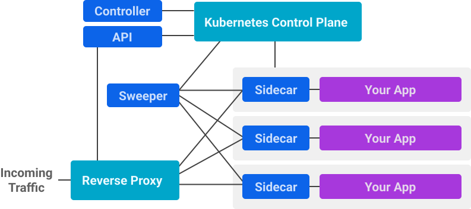

# Spawner

**Spawner** allows web applications to create [**session-lived backends**](https://driftingin.space/posts/session-lived-application-backends),
which are server processes dedicated to individual (or small groups of) users.

The server processes can be any server that speaks HTTP, including WebSocket servers. Spawner provides
an API for spinning these servers up when a new user connects, and automatically terminates
them when the user disconnects.

Spawner is still new and evolving. If you're interested in using it, we'd love
to hear about your use case and help you get started. Feel free to open an issue on GitHub or contact
[Paul](https://github.com/paulgb) at [paul@driftingin.space](mailto:hi@driftingin.space).

## Use cases

Spawner is intended for cases where a web app needs a dedicated, stateful back-end to talk to for the
duration of a session. One area where this approach is currently common is web-based IDEs like
[GitHub Codespaces](https://github.com/features/codespaces), which spin up a container for each user
to run code in. It's also useful as a back-end for real-time collaboration, when the document state
is non-trivial and needs more than just a Pub/Sub architecture (see e.g.
[Figma's description](https://www.figma.com/blog/rust-in-production-at-figma/) of how they run one
process per active document.)

By making it low-stakes to experiment with this architecture, our hope is
that Spawner will help developers find new use-cases, like loading a large dataset into memory
to allow low-latency interactive data exploration.

Depending on your needs, it may also make sense as a back-end for games and virtual spaces, but also
see [Agones](https://agones.dev/site/) for that use case.

## Architecture

Spawner is built on top of [Kubernetes](https://kubernetes.io/), an open-source container orchestration
system. Spawner provides the `SessionLivedBackend` [custom resource](https://kubernetes.io/docs/concepts/extend-kubernetes/api-extension/custom-resources/),
representing a single instance of an application backend, and a series of components which act together
to own the lifecycle of that backend:

- **API** provides a JSON over HTTP API for creating and checking the status of `SessionLivedBackend` instances.
- **Controller** watches for the creation of `SessionLivedBackend` objects and creates the backing compute and
  network resources needed to provide the backend and enable an external user to connect to it.
- **Sidecar** is a lightweight HTTP proxy that runs next to the application container you provide. It keeps
  a count of active WebSocket connections, and a timestamp of the last HTTP request, which it reports to a
  Sweeper.
- **Sweeper** runs on each node of the cluster and opens a connection to the sidecar of every application backend
  running on that node. When it detects that a backend is idle, it marks that backend for termination so that its
  resources can be used for another backend.

## More info & getting started

See the [docs](https://github.com/drifting-in-space/spawner/blob/master/docs/README.md) directory
for more information.
